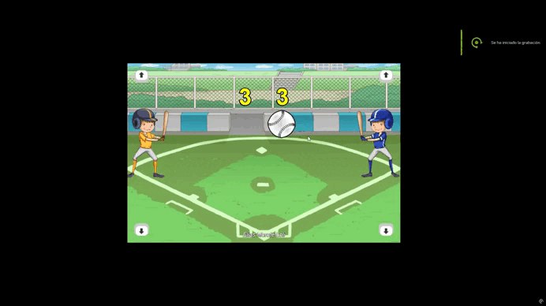

<h1 align="center">
    Juego 2D con Phaser 🎮
</h1>

[](https://github.com/XtrullorEas)
#### [See it Live](https://xtrulloreas.github.io/JuegoJS/)




Un juego 2D desarrollado con JavaScript y el framework Phaser. Implementa controles básicos, comportamientos de sprites y mecánicas de juego simples.  


## 🚀 Características
- Movimiento del personaje con controles de teclado
- Sistema de colisiones básico
- Sprites animados
- Escena jugable básica

## 🏗️ Estructura del proyecto
```plaintext
JuegoJS/
├── img/                   # Assets gráficos
│   ├── bola.png           # Sprite de la bola
│   ├── flecha.png         # Sprite flecha para movimiento
│   ├── mano1.png          # Sprite de juegador 1
│   ├── mano2.png          # Sprite de juegador 2
│   └── fondo.jpg          # Fondo del juego
├── index.html             # Página principal (HTML)
├── javascript.js          # Lógica del juego (Javascript)
└── phaser.min.js          # Librería Phaser 3
```
## 🛠️ Tecnologías  
-   
-   
-   

## ▶️ Cómo ejecutar
1. Clona el repositorio:
   ```bash
   git clone https://github.com/XtrullorEas/JuegoJS.git

2. Abre el archivo `index.html` en tu navegador web.


## 📄 Licencia
Este proyecto está bajo la licencia MIT. Ver archivo [License](License.md) para más detalles.
